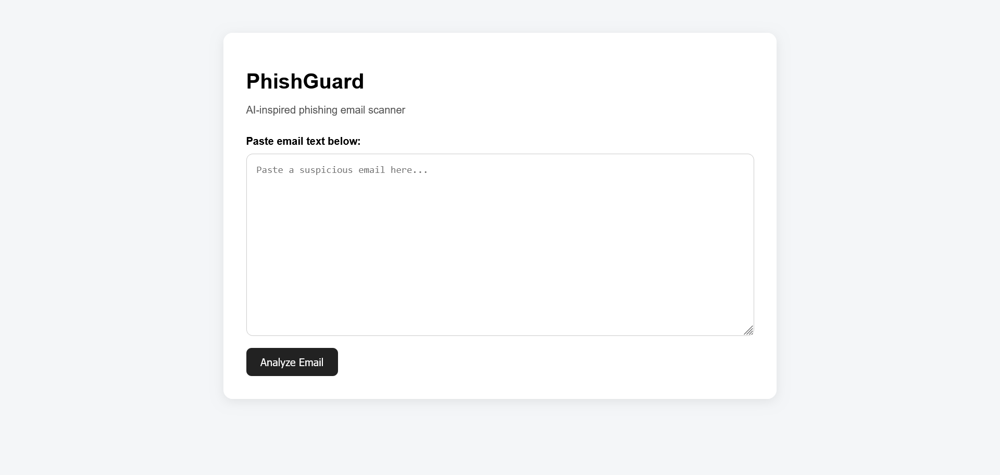
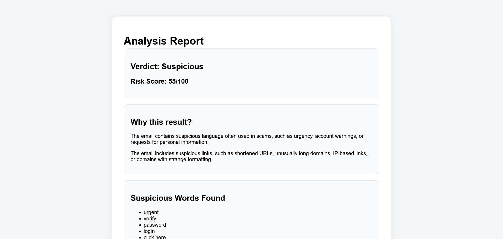
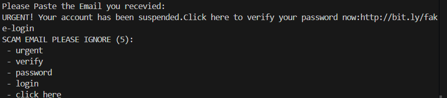

# PhishGuard — AI-Based Phishing Email Detection Tool

PhishGuard is a cybersecurity project that analyzes email text and detects possible phishing indicators. The tool checks for suspicious words, risky links, shortened URLs, and common scam patterns, then generates a risk score and verdict.

This project started as a Python terminal scanner and was later upgraded into a Flask web application.

---

## Project Overview

Phishing emails are one of the most common ways attackers steal passwords, personal information, and financial data. PhishGuard helps users identify suspicious emails by analyzing the content and links inside the message.

The goal of this project is to combine cybersecurity, Python programming, and web development into one practical tool.

---

## Current Version

The current version is:

**Version 2 — Flask Web Application**

Version 2 allows users to paste suspicious email text into a website and receive a phishing analysis report.

---

## Features

- Detects suspicious phishing-related keywords
- Extracts links from email text
- Flags shortened URLs such as `bit.ly`, `tinyurl.com`, and `t.co`
- Detects IP-based links
- Flags unusually long domains
- Flags domains with suspicious formatting
- Calculates a phishing risk score
- Gives a verdict:
  - Likely Safe
  - Suspicious
  - Likely Phishing
- Provides explanations for why an email may be risky
- Includes both terminal and web app versions

---

## Screenshots

### Homepage



### Analysis Result Page



### Terminal Version



To add screenshots, create an `images` folder in your project and place your screenshots inside it.

Example:

```text
phishguard/
│
├── images/
│   ├── homepage.png
│   ├── results.png
│   └── terminal-version.png
```

---

## Version History

---

## Version 2 — Flask Web Application

Version 2 is the current version of PhishGuard. It upgraded the project from a terminal-based Python scanner into a web application using Flask.

### What Changed in Version 2

- Added a web interface using HTML and CSS
- Created a homepage where users can paste email text
- Added a results page to display the phishing analysis report
- Separated the detection logic into a cleaner `detector.py` file
- Used Flask routes to handle form submissions
- Improved the project structure using `templates/` and `static/` folders
- Made the tool easier for non-technical users to use
- Added clearer explanations for why an email may be suspicious
- Improved the visual presentation of the analysis report

### Version 2 Features

- Paste an email into a website
- Click an **Analyze Email** button
- View a phishing verdict
- View a risk score
- See suspicious words found
- See links found in the email
- See suspicious links and reasons
- View a clean email analysis report
- Analyze another email from the results page

### Version 2 Web App Flow

```text
User pastes email
        ↓
Flask sends text to detector.py
        ↓
PhishGuard scans content and links
        ↓
Risk score and verdict are generated
        ↓
Results are shown on the website
```

---

## Version 1 — Python Terminal Scanner

Version 1 was the first version of PhishGuard. It was a command-line Python program that analyzed email text directly in the terminal.

### What Version 1 Did

- Allowed users to paste email text into the terminal
- Scanned the email for suspicious phishing-related keywords
- Extracted links from the email
- Checked links for suspicious patterns
- Calculated a phishing risk score
- Printed a phishing analysis report in the terminal

### Version 1 Features

- Terminal-based email input
- Suspicious keyword detection
- Link extraction
- Shortened URL detection
- IP-based link detection
- Long domain detection
- Risk score calculation
- Text-based phishing report

### Version 1 Example Output

```text
=== Phishing Analysis Report ===

Verdict: Suspicious
Risk Score: 41/100

Suspicious Words Found:
- urgent
- verify
- password
- account suspended

Links Found:
- http://bit.ly/fake-login

Suspicious Links:
- http://bit.ly/fake-login: shortened link
```

---

## Main Changes From Version 1 to Version 2

| Area | Version 1 | Version 2 |
|---|---|---|
| Interface | Terminal | Flask website |
| User input | Pasted into command line | Pasted into web form |
| Output | Printed in terminal | Displayed on results page |
| Code structure | Mostly one Python file | Split into `app.py`, `detector.py`, HTML, and CSS |
| Design | No visual design | Styled web interface |
| Usability | Better for developers | Easier for normal users |
| Presentation | Basic text report | Clean web-based report |
| Project quality | Basic prototype | More polished application |

---

## Project Structure

```text
phishguard/
│
├── app.py
├── detector.py
│
├── templates/
│   ├── index.html
│   └── result.html
│
├── static/
│   └── style.css
│
├── images/
│   ├── homepage.png
│   ├── results.png
│   └── terminal-version.png
│
└── README.md
```

---

## How It Works

PhishGuard uses rule-based detection to identify common phishing indicators.

The program checks for:

1. Suspicious words
2. Suspicious links
3. Shortened URLs
4. IP-based URLs
5. Very long domains
6. Domains with unusual formatting

The scanner then calculates a risk score and gives a verdict.

---

## Risk Score System

PhishGuard assigns points based on suspicious indicators.

Examples:

- Suspicious keyword found: adds risk
- Shortened link found: adds risk
- IP address used instead of a domain: adds risk
- Very long domain: adds risk
- Multiple suspicious patterns: higher risk score

The final score is capped at 100.

### Verdict Levels

| Score Range | Verdict |
|---|---|
| 0–34 | Likely Safe |
| 35–69 | Suspicious |
| 70–100 | Likely Phishing |

---

## Example Test Email

You can test the app with this sample email:

```text
URGENT! Your account has been suspended.
Click here to verify your password now:
http://bit.ly/fake-login
```

Expected result:

```text
Verdict: Suspicious
Risk Score: Medium/High
Reason: Urgent language and shortened link detected
```

---

## How to Run the Project

### 1. Clone the Repository

```bash
git clone https://github.com/YOUR-USERNAME/phishguard.git
cd phishguard
```

### 2. Install Flask

```bash
pip install flask
```

### 3. Run the App

```bash
python app.py
```

### 4. Open in Browser

Go to:

```text
http://127.0.0.1:5000
```

---

## Files Explained

### `app.py`

This file runs the Flask web application. It handles the homepage and the analysis form.

### `detector.py`

This file contains the phishing detection logic. It scans the email text, extracts links, calculates the risk score, and returns the result.

### `templates/index.html`

This is the homepage where users paste the email text.

### `templates/result.html`

This page displays the phishing analysis report.

### `static/style.css`

This file styles the website and makes the app look cleaner.

---

## Technologies Used

- Python
- Flask
- HTML
- CSS
- Regular Expressions
- URL Parsing

---

## Cybersecurity Concepts Used

- Phishing detection
- Email security
- Suspicious link analysis
- Social engineering indicators
- Risk scoring
- Threat detection logic
- URL analysis

---

## Future Improvements

Planned features for future versions:

- Add a machine learning model to classify emails as safe or phishing
- Train the model using phishing email datasets
- Add ML confidence scores
- Add AI-generated explanations
- Add PDF report generation
- Improve sender email analysis
- Improve domain reputation checks
- Add file upload support for `.eml` files
- Deploy the website online
- Add a browser extension version

---

## Version Roadmap

| Version | Description | Status |
|---|---|---|
| Version 1 | Python terminal phishing scanner | Complete |
| Version 2 | Flask web application | Complete |
| Version 3 | Machine learning email classifier | Planned |
| Version 4 | AI explanation system | Planned |
| Version 5 | Online deployment | Planned |

---

## What I Learned

Through this project, I learned how to build a cybersecurity tool from the ground up. I started with a basic Python scanner, then upgraded it into a web application using Flask.

I learned how phishing emails use urgency, suspicious links, and social engineering tactics to trick users. I also learned how to organize a Python project, build a Flask web app, and create a cleaner user interface for a cybersecurity tool.

This project helped me connect my interests in cybersecurity, programming, and machine learning.

---

## Disclaimer

PhishGuard is an educational cybersecurity project. It is not a replacement for professional email security software. Users should still be careful when opening links or attachments from unknown senders.
